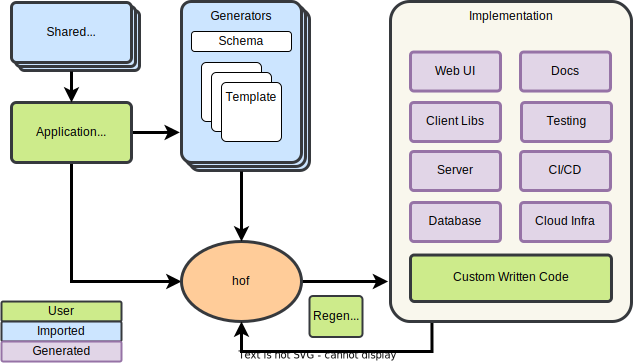

# hof - the high code framework

Hof is a tool that weaves together data models, code generation, and task engine with CUE.
Automate repetitive setup, code, changes, and workflows using your tools. Hof is technology agnostic.

<!-- something about osurce of thuth, unified abstraction later, interoperablility... -->

|-----------|------------|
| __data model__         | define & manage data models - the source of truth |
| __code generation__    | data + template = _ (anything) - technology agnostic |


1. __data model__ - define & manage data models - the source of truth
2. __code generation__ - data + template = _ (anything) - technology agnostic
3. __app blueprints__ - bootstrap config and other files - consistent skaffolding
4. __task engine__ - composable, extendable tasks and workflows - a DAG engine
5. __modules__ - composable data models & generators - an ecosystem



__`hof` is a CLI tool you will add to your workflows.__
It is technology agnostic, captures common patterns and boilerplate,
has modules that span technologies, and continues to work as your application evolves.

- data model management so you can checkpoint, diff, and calculate migrations
- code generation to scaffold consistent code and boilerplate across the stack
- diff3 to support custom code, data model updates, and code regeneration
- modular and composable code generators with dependency management

`hof` uses [CUE](https://cuelang.org) extensively to power the DX and implementation.

Learn more about CUE: [cuelang.org](https://cuelang.org) | [cuetorials.com](https://cuetorials.com)


## [Documentation](https://docs.hofstadter.io)

Please see __[docs.hofstadter.io](https://docs.hofstadter.io)__ to learn more.

The [getting-started](https://docs.hofstadter.io/getting-started/) section will take you on a tour of hof.
The [first-example](https://docs.hofstadter.io/first-example/) section shows you how to build and use a generator.

Join us on Slack! [https://hofstadter-io.slack.com](https://join.slack.com/t/hofstadter-io/shared_invite/zt-e5f90lmq-u695eJur0zE~AG~njNlT1A)
We are more than happy to answer your questions.


## Install or [try hof on github](https://github.com/codespaces/new?hide_repo_select=true&ref=main&repo=604970115)


Download `hof` just once.
After that `hof` will prompt you to update and
install new releases as they become available.

You can always find the latest version on our
[GitHub releases page](https://github.com/hofstadter-io/hof/releases)
or use `hof` to install a specific version of itself with `hof update --version vX.Y.Z`.

```shell
# Homebrew
brew install hofstadter-io/tap/hof

# Latest Release
go install github.com/hofstadter-io/hof/cmd/hof@latest

# Latest Commit
go install github.com/hofstadter-io/hof/cmd/hof@_dev

# Shell Completions (bash, zsh, fish, power-shell)
echo ". <(hof completion bash)" >> $HOME/.profile
source $HOME/.profile

# Show the help text
hof --help
```


## Contributing & Community

Interested in helping out or hanging out? The best ways to get started are

1. [The Contributing Guild](https://docs.hofstadter.io/contributing/)
2. [Joining the Community](https://docs.hofstadter.io/help-and-support/#community/)


## Main Commands

### hof

```
hof - the high code framework

  Learn more at https://docs.hofstadter.io

Usage:
  hof [flags] [command] [args]

Main commands:
  create                dynamic blueprints from any git repo
  datamodel             manage, diff, and migrate your data models
  gen                   modular and composable code gen: CUE & data + templates = _
  flow                  run CUE pipelines with the hof/flow DAG engine
  fmt                   format any code and manage the formatters
  mod                   CUE dependency management based on Go mods

Additional commands:
  help                  help about any command
  update                check for new versions and run self-updates
  version               print detailed version information
  completion            generate completion helpers for your terminal
  feedback              open an issue or discussion on GitHub

Flags:
  -h, --help             help for hof
      --inject-env       inject all ENV VARs as default tag vars
  -p, --package string   the Cue package context to use during execution
  -q, --quiet            turn off output and assume defaults at prompts
  -t, --tags strings     @tags() to be injected into CUE code
  -v, --verbosity int    set the verbosity of output

Use "hof [command] --help / -h" for more information about a command.

```

